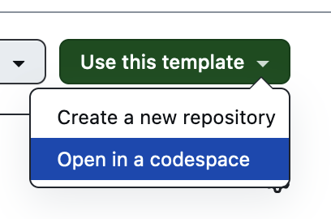
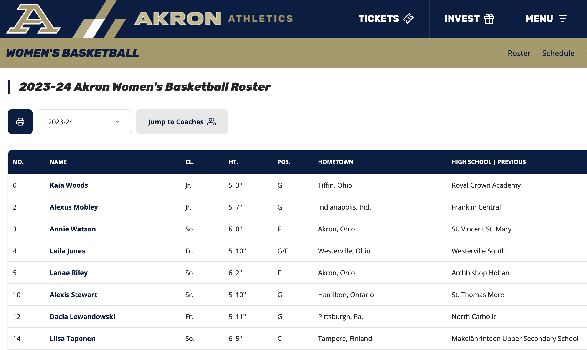
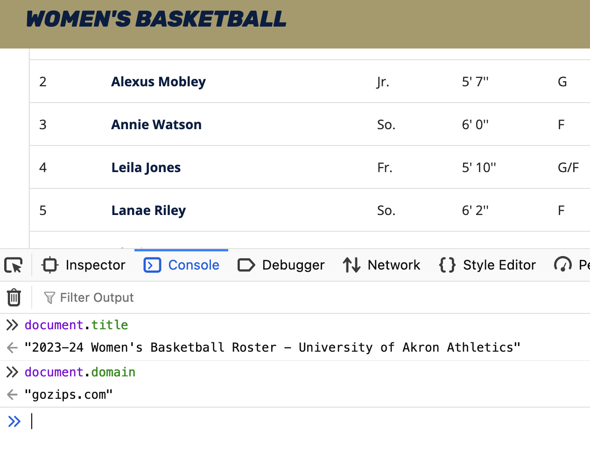
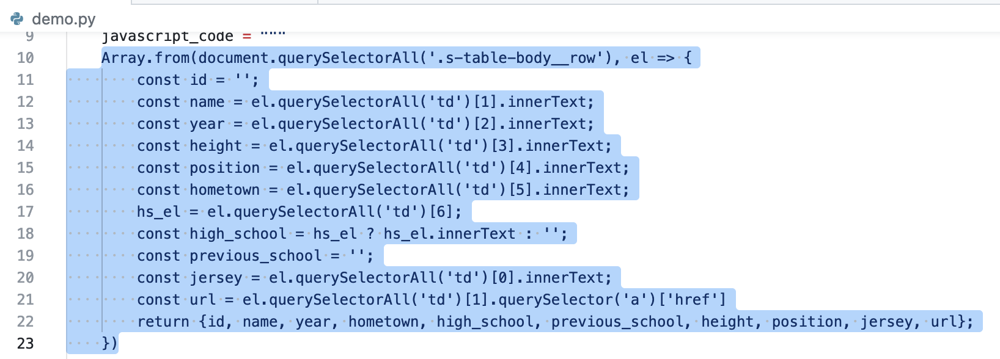
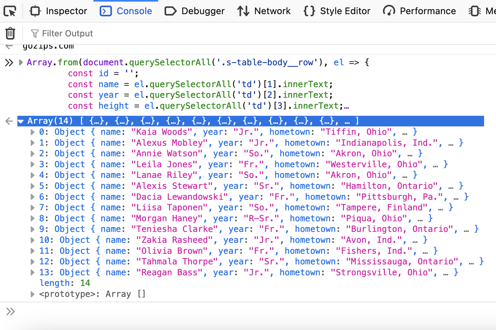

# Using Shot-Scraper to grab data from difficult sites
### NICAR 2024
#### Derek Willis, University of Maryland

You can follow along with this hands-on session using GitHub Codespaces. From this repository, click the "Use This Template" button on the top right and choose "Open in a codespace":



This repository demonstrates how to use the Python library shot-scraper to scrape websites that rely on a lot of JavaScript and might seem straightforward to scrape but are not. Websites like [this one](https://gozips.com/sports/womens-basketball/roster):



Using your browser's inspect tool, you can see that the structure looks fairly normal: a lot of div tags, and player information is contained in a table tag. Seems simple, right? Just fire up a Python shell and use our friends requests and BeautifulSoup. It should be easy, right?

```
>>> import requests
>>> from bs4 import BeautifulSoup
>>> r = requests.get("https://gozips.com/sports/womens-basketball/roster")
>>> soup = BeautifulSoup(r.text, "html.parser")
>>> soup.find('table')

>>>
```

Right?

Who are you going to believe, this code or your lying eyes? There is a table on that page, but it is getting loaded _after_ the page loads, which means that requests won't "see" it in the source code. Yes, you could play around with HTML sessions or use selenium to emulate a browser, but that table and its rows are right there. Like they are taunting you.

There's a better way, and that's where [shot-scraper](https://shot-scraper.datasette.io/en/stable/index.html) comes in.

Simon Willison, friend of journalists who need to work with data, built this tool to enable a more automated process for taking screenshots. And it's great for that! Just ask Ben Welsh, who built [news.homepages](https://palewi.re/docs/news-homepages/), which automatically grabs screenshots daily. As a screenshot tool it's powerful and flexible.

But if you're working with websites at all in 2024, that means you're likely working with JavaScript. And that's where shot-scraper really shines, because it can execute JavaScript on remote pages just as if you opened up the console log and started typing.

Let's try this out the old-fashioned way, in that console log. Here we can interact with the document as it appears in the browser.



If you can interact with one HTML element on the page, you can do that with multiple elements. Like rows in a table, for example. The way we do that in JavaScript is by using `document.querySelector()` (for one element) and `document.querySelectorAll()` (for multiple elements).

Take a look at `demo.py`, and in particular lines 10-23. See that JavaScript code? Copy the part I've highlighted below:



And paste it into the console. You should see something like this:



Go ahead, click inside one of those 14 objects. Lovely, lovely JSON. How did we do that? Let's go back to the code and see.

I'm not a JavaScript person myself, but this is pretty straightforward: identify certain elements and grab them. In some cases where we need to check to see if there's anything inside an element at all, as we do for high schools here, we can use JavaScript's ternary operator to do that.

### How shot-scraper gets called

shot-scraper is a command line tool, but that doesn't mean you can't use it from inside a Python script. As long as you have it installed, you should be able to use Python's built-in `subprocess` module to call it, including using command-line arguments like we do here. Let's dive into Python to test things out.


### How I've used shot-scraper

* [Women's College Basketball Rosters](https://github.com/Sports-Roster-Data/womens-college-basketball)
* [Women's College Volleyball Rosters](https://github.com/Sports-Roster-Data/womens-volleyball)
